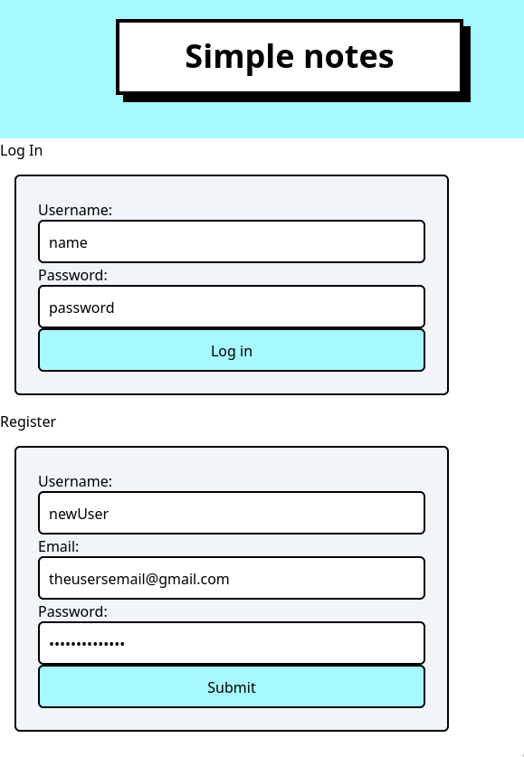
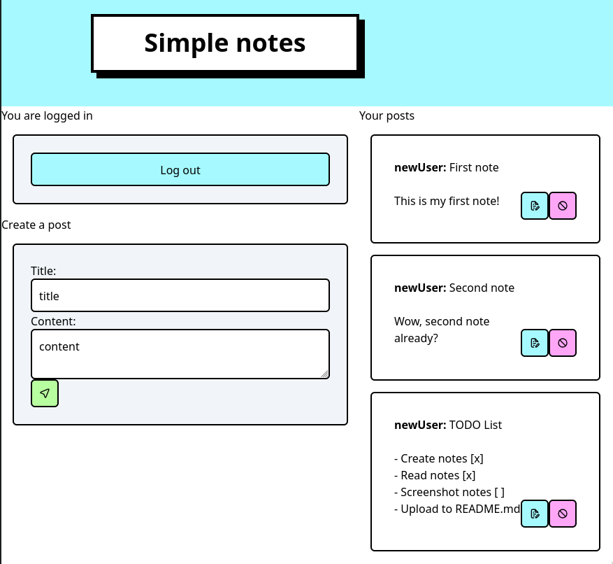

# Notes app

A simple notes app implemented using Laravel.




Users can log in or register and then create new posts or edit old ones.
Other users cannot access your notes without proper credentials.

## Prerequisites

- [PHP](https://www.php.net/downloads.php).
- [Laravel 12](https://laravel.com/docs/12.x/installation).
- [npm](https://docs.npmjs.com/downloading-and-installing-node-js-and-npm)

## Installation

To get started with this project, run the following commands:

```bash
git clone https://github.com/ikugo-dev/notes-app.git
cd notes-app
composer install
npm install package.json
npm run build
touch databases/database.sqlite
php artisan migrate
php artisan serve
```

## Usage

The default port is on **8000**, but you can change that by using:
```bash
php artisan serve --port=8080
```
